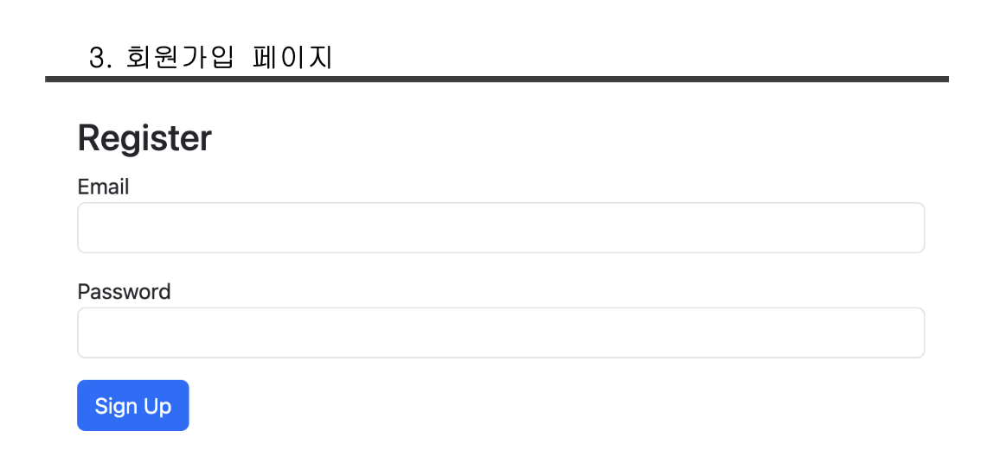
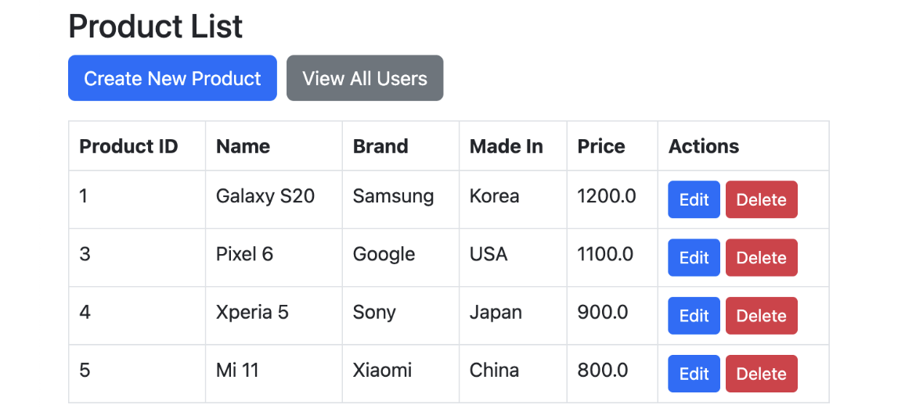
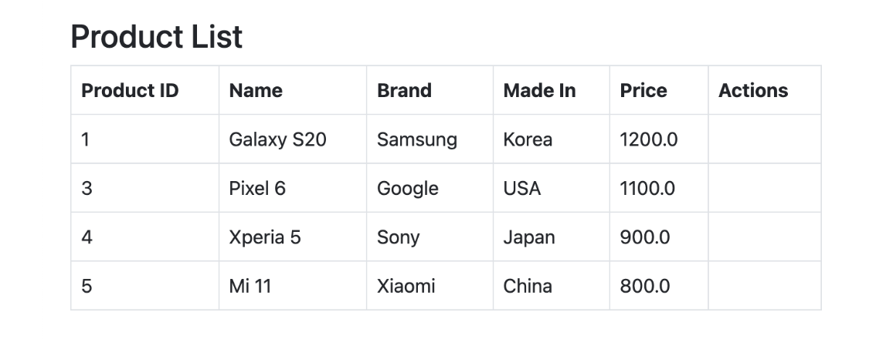
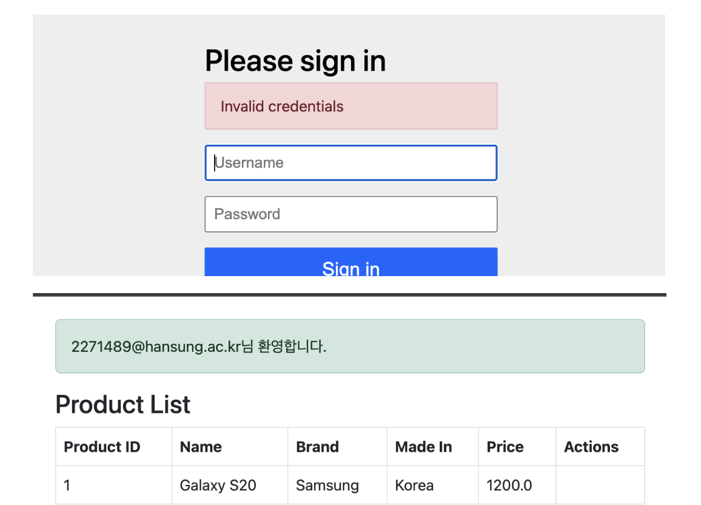
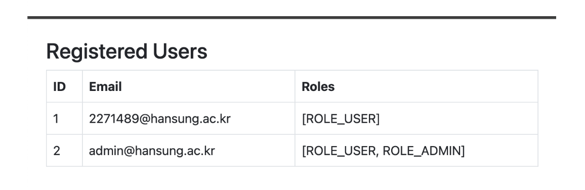

## Spring Boot + Spring Security 기반 상품 관리

### 🛠 기술 스택
- Backend: Spring Boot 3, Spring Data JPA, Spring Security
- Frontend: Thymeleaf
- Database: MySQL

### ✨ 주요 기능
1. 사용자 인증
   - 회원가입
   - 로그인 및 로그아웃 기능 (Spring Security)
   - 비밀번호 암호화 (BCryptPasswordEncoder)
   - 로그인 성공 시 상품 목록으로 이동

   

   
2. 권한 기반 인가
   - 관리자 계정 등록
   - **관리자 계정** 로그인 시: 상품 등록, 수정, 삭제 기능
   - **일반 계정** 로그인 시:  상품 목록 조회만 가능
  
   
   

   
3. 추가 기능
   - 상품 등록/수정 시 유효성 검사 (@Min으로 가격 0이상)
   - 로그인 후 환영 메시지
   - 관리자 전용 전체 사용자 리스트 페이지
  
   
   

### 💡 고민과 선택
- 권한 기반 인가 기능
  - 회원가입 페이지를 따로 만들 것인가 
    -> 회원가입 페이지를 동일하게 가져가지만 경로를 다르게 해서 관리자 권한을 부여
